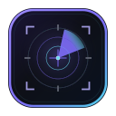

# Shadow Mission Control



  

Local-only mission-control HUD for a Linux workstation. Dark chrome, live telemetry, no cloud calls.

The server binds **loopback only** (`127.0.0.1:7420`). Nothing is uploaded. No account, API key, or telemetry backend is required.

## What it shows

| Panel | Source |
| --- | --- |
| CPU | `/proc/stat`, `/proc/loadavg`, `/proc/cpuinfo`, `cpufreq` sysfs |
| GPU | `nvidia-smi --query-gpu` (util, clocks, power, fan, temp, pstate) |
| VRAM | `nvidia-smi` memory.used / memory.total |
| RAM | `/proc/meminfo` |
| Disk I/O | `/proc/diskstats` byte rates |
| Disk usage | `/proc/mounts` + `statvfs` |
| Network | `/proc/net/dev` rx/tx rates |
| Temperatures | `/sys/class/hwmon` + GPU from nvidia-smi |
| AI models | Local listeners such as Ollama `:11434`, LM Studio `:1234`, Invoke `:9090` |
| GPU processes | `nvidia-smi --query-compute-apps` |
| Docker | `docker ps` |
| Services | curated `systemctl` / `systemctl --user` |

Missing Docker or `nvidia-smi` is reported in-panel. The rest of the HUD keeps updating.

## Install (Linux)

Requires Python 3.10+ and, for the first UI build, Node.js.

```bash
git clone https://github.com/Shadowfetchapps/shadow-mission-control.git
cd shadow-mission-control
./scripts/install-linux.sh
```

That installs `shadow-mission-control` to `~/.local/bin`, builds the HUD, and writes a desktop entry.

## Launch

- App menu: **Shadow Mission Control**
- CLI: `shadow-mission-control`
- Server only: `shadow-mission-control --no-browser`
- URL: <http://127.0.0.1:7420>
- Health: `curl -s http://127.0.0.1:7420/api/health`
- Snapshot: `curl -s http://127.0.0.1:7420/api/metrics`
- Live stream: `GET /api/stream` (SSE, 1s)

The launcher starts the Python metrics server on loopback if needed, then opens a resizable Chromium-family `--app` window (default 1400×900). Window chrome state is stored under `~/.local/state/shadow-mission-control/`.

## Development

```bash
python3 server/app.py
cd ui && npm install && npm run build
```

UI source is Vite + React. The server serves `ui/dist` and `/api/*`.

```bash
python3 -m pytest
```

## Privacy

This repository is written to ship **without** machine names, home directories, emails, tokens, or hardware identifiers. At runtime the HUD reads live local metrics on your machine and never leaves loopback. See [SECURITY.md](SECURITY.md).

## License

MIT. See [LICENSE](LICENSE).
